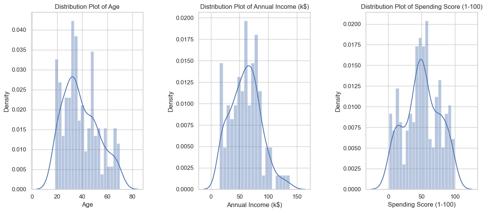
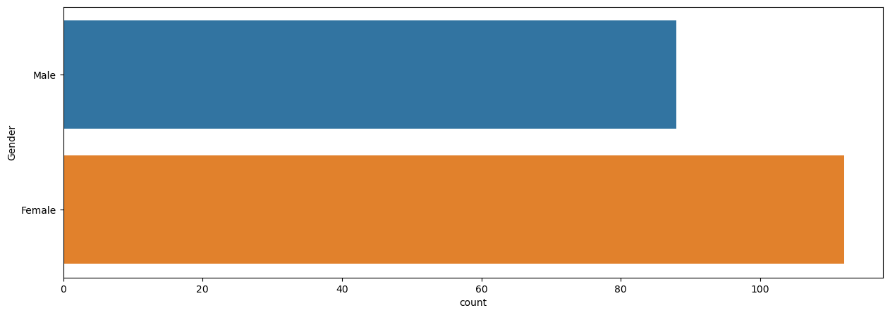
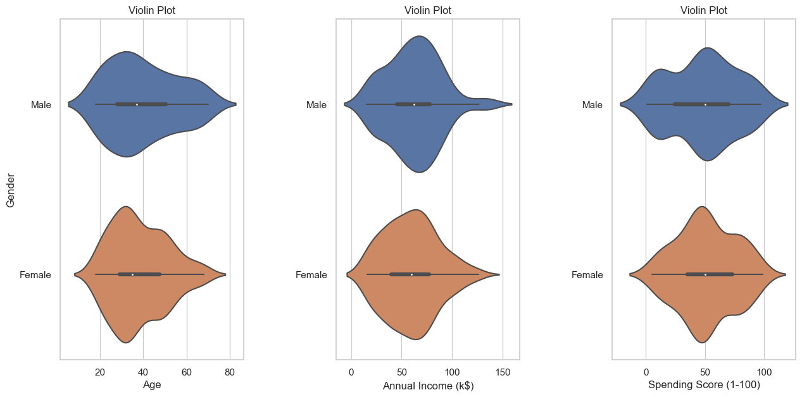
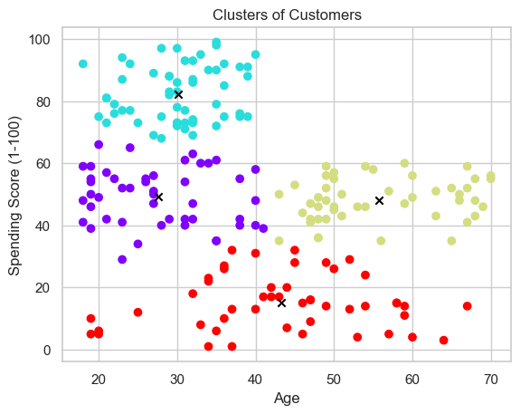
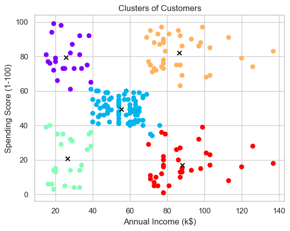

# Mall Customer Segmentation

This repository contains code for customer segmentation based on the dataset of a mall. The goal is to cluster customers into different groups based on their demographics and spending behavior.

## Introduction

Customer segmentation is crucial for businesses to understand their customer base and tailor their marketing strategies accordingly. This project uses K-Means clustering to segment customers based on their age, annual income, and spending score.

## Dataset

The dataset used in this project is `Mall_Customers.csv`, which contains the following columns:
- CustomerID: Unique ID for each customer.
- Gender: Gender of the customer.
- Age: Age of the customer.
- Annual Income (k$): Annual income of the customer in thousands of dollars.
- Spending Score (1-100): Score assigned to the customer based on their spending behavior.


## Dependencies

To run the code in this repository, you'll need the following libraries:
- numpy
- pandas
- matplotlib
- seaborn
- scikit-learn

You can install these libraries using pip:
```
pip install numpy pandas matplotlib seaborn scikit-learn
```

## Data Preprocessing

The data preprocessing steps include:
1. Importing the dataset.
2. Renaming columns for consistency.
3. Checking for missing values.
4. Dropping unnecessary columns (like CustomerID).

## Data Visualization

Various plots are created to understand the distribution of different attributes and their relationships.

### Distribution Plots




###  Gender Distribution



### Violin Plots



## Customer Segmentation

###  Elbow Method

The elbow method is used to determine the optimal number of clusters by plotting the Within-Cluster Sum of Squares (WCSS) for different values of k.

### K-Means Clustering

We use the K-Means clustering algorithm to segment customers into different groups based on their attributes.

#### Clustering Based on Age and Spending Score



#### Clustering Based on Annual Income and Spending Score



## Results

After clustering, we can visualize the segmented customer groups. The clustering results provide insights into different customer segments based on their age, annual income, and spending scores.


## License

This project is licensed under the MIT License - see the [LICENSE](LICENSE) file for details.
